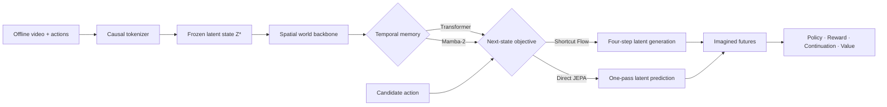
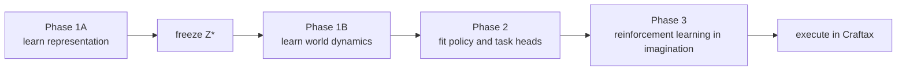

# D4MJ

### An action-conditioned world model that learns from video, simulates futures, and trains agents inside its own predictions.

[Dreamer 4](https://arxiv.org/abs/2509.24527) showed that a world model can learn
game mechanics from offline video and train a control policy entirely in
imagination—culminating in the first offline-only Minecraft diamond agent. Its
key idea is to treat control as scalable video prediction: compress observations,
predict the future conditioned on actions, and let an actor practise inside those
predictions.

D4MJ turns that idea into a source-audited, GPU-conscious research system for
Craftax. The project asks a practical question:

> Can JEPA-style latent prediction and Mamba-2 memory preserve the mechanics an
> agent needs, without relying on a frontier-scale video model?

### Why JEPA?

Dreamer 4 generates future latents by repeatedly restoring corrupted candidates.
JEPA suggests a leaner alternative: learn the action-conditioned structure of the
next latent directly, without reconstructing pixels or running a denoising chain.
D4MJ tests whether that efficiency preserves the small interaction details control
depends on—not merely whether its average prediction loss is low.

### Why Mamba?

Imagination repeatedly extends long temporal state. Transformer attention makes
that history explicit in a growing cache; Mamba-2 compresses it into fixed-size
recurrent state with linear sequence processing. D4MJ tests whether that state is
a practical long-context memory for world models while preserving exact recurrent
execution semantics.

The independent [TC-LeWM–Mamba M0–M3 implementation](d4mj/docs/TC_LEWM_M0_M3_STATUS.md) now provides joint encoder/world training and persistent differentiable recurrence. It has separate recipes, checkpoints and component gates. Its scientific screening, recursive bridge, actor and renderer remain gated; no learned-control result is claimed.

## The architecture



The same data, tokenizer, token layout, recurrent-state contract, and evaluation
path are shared across the Flow/Direct × Attention/Mamba experiment. That makes
architecture comparisons causal rather than four loosely related implementations.



## What the investigation found

| Finding | Evidence |
|---|---|
| The tokenizer export was a real bottleneck | Moving from 32 to 64 latent slots raised export AUC from **0.591 to 0.802**; the result replicated across two tokenizer seeds. |
| Better representations translated into better dynamics | Across two seeds, counterfactual transfer rose from **0.095–0.105** to **0.261–0.355**, while action-effect error crossed below the no-action null. |
| Direct needed richer action conditioning | A one-block candidate-action token mixer improved transfer by **+0.053 / +0.066** and reduced normalized action-effect error by **0.332 / 0.416** across two world seeds. |
| The remaining failure is increasingly a data question | Held-out successor error is **2.6× larger** in the least-covered state quartile than the best-covered quartile. |

Negative results are kept as first-class evidence: removing the bounded output,
widening or deepening post-hoc decoders, changing loss weights, and several
consequence-shaping objectives did not fix the failure. Each eliminated a plausible
story and narrowed the next experiment.

## Engineering depth

The research is backed by production-style experimental infrastructure:

- recurrent Transformer caches and Mamba-2 state with scan/step parity gates;
- transactional imagined rollouts that cannot mutate rejected candidate state;
- episode-safe action/reward alignment and generated-prefix training;
- atomic checkpoints binding weights, config, source hashes, optimizer, and RNG streams;
- immutable sharded datasets, frozen latent-cache identities, and paired bootstrap evaluation;
- **135 passing semantic tests** for the current D4MJ implementation.

Implemented in Python and PyTorch, with CUDA/Triton Mamba kernels and an explicit
6 GB GPU design budget.

## Run the checks

```bash
uv venv --python 3.12 .venv
source .venv/bin/activate
uv pip install -r requirements.txt pytest

# CPU-compatible semantic suite
python -m pytest d4mj/tests -q

# Full Flow/Direct × Attention/Mamba deployment gates; requires the CUDA setup
python -m d4mj
```

## Explore

- [`d4mj/`](d4mj/) — current model, training, rollout, and evaluation code
- [`d4mj/spec/ARCHITECTURE.md`](d4mj/spec/ARCHITECTURE.md) — full system and source boundaries
- [`d4mj/spec/DECISIONS.md`](d4mj/spec/DECISIONS.md) — evidence ledger and declared deviations
- [`artifacts/eda/`](artifacts/eda/) — executable diagnostics and compact result artifacts
- [`third_party/`](third_party/) — pinned papers and source implementations

**Status:** active research. D4MJ is Dreamer-4-inspired, not a claimed faithful
reproduction or a solved Craftax agent. MIT licensed.
