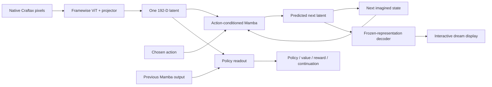

# Proposed architecture and executable contracts

Implementation boundary: M0–M3 now use the actual persistent state API. See [status and source resolutions](TC_LEWM_M0_M3_STATUS.md); actor, recursive bridge and renderer sections below remain planned.

Read the [scope](README.md) and [decision ledger](TC_LEWM_DECISIONS.md) with this document. Everything below describes the new family unless explicitly marked legacy. Numerical choices are proposed; interface invariants are requirements for a valid implementation.

## 1. System and phases



The graph summarizes dependencies; the time-indexed equations below determine execution. The reward for action `a_t` is read from the **successor** readout, not the current policy readout.

| Phase | Inputs | Trainable | Frozen / absent | Output |
|---|---|---|---|---|
| Joint Phase 1, replaces 1A + 1B | Raw four-frame windows and three outgoing actions | Encoder, both projectors, action embedding, Mamba predictor | No decoder, heads, EMA, task prompt, or stopped target | Joint checkpoint with encoder **and trained world** |
| Export | Raw archive | Nothing | Encoder parameters and buffers, eval mode | Versioned latent archive; fixed normalization |
| Phase 2 bridge | Cached observed sequences, recorded actions and outcomes; recursive generated suffix | Existing trained world, readout, BC/reward/continuation heads | Encoder; predictor BN running statistics | World trained at measured recursive depth; frozen BC prior candidate |
| Phase 3 | Cached starting contexts; learned rollouts only | Actor and critic bodies/outputs | Encoder, world, readout, reward/continuation, BC prior, all their buffers | Imagination-trained actor and critic |
| Decoder fit | Frozen real latent/pixel pairs | Display decoder only | Encoder, world, all agent components | Separately identified renderer |
| Play | One real seed context, then user/actor actions | Nothing | All modules, eval mode | Generated latent/pixel session with predicted outcomes |

Phase 2 is not another fresh world initialization. Phase 3 does not collect simulator experience in the initial offline protocol. The decoder can train after export independently of Phase 2/3 because it reads the frozen encoder's coordinate system.

## 2. Encoder and exported representation — TC-03, TC-04

Input storage is HWC `uint8 [B,T,63,63,3]`; computation uses contiguous CHW float pixels scaled to `[0,1]`, then fixed ImageNet mean `(0.485,0.456,0.406)` and std `(0.229,0.224,0.225)` (TC-29). This explicit preprocessing is part of the recipe and cache identity. No resize, crop, augmentation, token masking, or temporal encoding occurs in this arm.

Use a from-scratch ViT-Tiny configuration: patch 7, 81 image patches plus CLS, width 192, 12 layers, 3 heads, MLP ratio 4, GELU, learned absolute spatial positions. Take the final CLS vector. The encoder projector is `Linear(192,2048) → BatchNorm1d(2048) → GELU → Linear(2048,192)`. Its output **is** the exported latent `z`, with logical shape `[B,T,192]` and compatibility shape `[B,T,1,192]` at interfaces that require a spatial axis. No tanh, terminal LayerNorm, L2 normalization, packing, or loss-only projector follows it.

BatchNorm sees the flattened `B*T` encoder samples during joint training, as in the base implementation's projector path. Export and all later calls use saved running statistics. Framewise architecture does not imply sample-independent training outputs while BN is in training mode. Eval-mode singleton, frame-batch, sequence-batch, cached and online encodings must agree within declared numerical tolerance.

There is no encoder temporal memory: encoder burn-in is zero. World memory and its burn-in are separate concepts. The old MAE encoder remains `64×16`, temporally contextual, and separately cached. A new family must never masquerade as another packing of those latents.

The exact ViT implementation/configuration must be pinned at implementation preflight. Match the base LeWM helper's construction rather than calling an arbitrary model named “tiny.” The chosen native resolution/patch layout, one camera, preprocessing, and downstream latent use are project adaptations. Compare CLS and post-projector retention before accepting the export.

## 3. Action-conditioned dynamics — TC-05 through TC-08

Use one temporal stream per environment, not the old `ACTION/CONDITION/SPATIAL/REGISTER/AGENT` token layout. For a current latent and outgoing action:

```text
q_t = Linear(concat(z_t, Embedding(a_t)))        # 192 + 64 -> 256
(u_t, M_{t+1}) = MambaStack(q_t, M_t)          # six residual blocks, width 256
z_hat_{t+1} = PredictorProjector(u_t)           # 256 -> 2048 -> 192, hidden BN + GELU
h_t = Readout(concat(z_t, u_{t-1}))             # 448 -> 256, LayerNorm + GELU
```

`MambaStack`: six pre-RMSNorm residual Mamba-2 blocks followed by RMSNorm; Mamba parameters `d_state=64`, `headdim=64`, `expand=1`, `d_conv=4`. No extra attention, spatial register, agent token, learned temporal position, dropout, or external Direct action mixer is included. The action influences every deeper block through the stack input. No claim is made that this matches the capacity of the source six-layer Transformer or the old eight-layer world.

Both projectors retain an unbounded output. The predictor projector's hidden BN uses flattened `B*(T-1)` teacher outputs during joint training. During Phase 2 its running statistics remain frozen, but its affine parameters and linear layers may train. This makes teacher and recursive calls use the same normalization function. That mode change is deliberate and must be logged; `requires_grad_(False)` alone does not freeze BN buffers.

### State definition: completed action pairs

Introduce a separate `PredictiveState`, not a reinterpretation of `WorldState`:

```text
P_t = (latent=z_t, memory=M_t, history=u_{t-1}, step=t)
M_t has consumed (z_0,a_0), ..., (z_{t-1},a_{t-1}).
M_t has NOT consumed z_t or a_t.
At reset: M_0=zero, u_{-1}=zero, z_0=encode(x_0), step=0.
```

The readout `h_t` contains current perception and previous action-conditioned history. It is computed before the current action is sampled. Heads consume `[B,T,1,256]`; their existing pooling is then an identity along the one-element agent axis. The readout is not an input to Mamba, so changing actor/value/task-readout weights cannot change world predictions. During Phase 2, head losses may still improve world parameters through gradients; architectural independence is different from gradient isolation.

**Advance in imagination:** compute the selected pair once from `P_t,z_t,a_t`; produce `z_hat_{t+1},u_t,M_{t+1}`; return `(z_hat_{t+1},M_{t+1},u_t,t+1)` and its readout. Do not ingest the predicted next latent until a next action is available.

**Observe a real successor:** from previous `P_t` and the action actually taken, compute the same pair update, encode actual `x_{t+1}`, and replace the predicted latent with that observation latent. Return `(z_{t+1},M_{t+1},u_t,t+1)`. Initial observation uses the reset path without an invented BOS transition. If a caller already has the selected pair-update result, it may reuse that result rather than advancing a second time; the API must make these two entry paths explicit.

**Counterfactual candidates:** each action starts from the same immutable `P_t`. Rejected memories are discarded. The selected candidate's memory is adopted because it contains exactly the accepted `(z_t,a_t)` pair. This intentionally differs from the old state's current-frame-inclusive commit contract and from the attachment's temporary query followed by a second commit pass. Test every memory tensor and module buffer for branch contamination.

**Teacher scan:** scan `z[:, :-1]` paired with the corresponding outgoing action sequence. The outputs predict `z[:,1:]`. Construct observed readouts by pairing `z_0..z_T` with `[zero,u_0..u_{T-1}]`. Pairing `z_t` with `u_t` would leak `a_t` into its own BC target and is forbidden.

**Prefill:** accept a context of `C` encoded frames with `C-1` actions, scan only the completed pairs, and return the last frame as the unconsumed current latent. Finite sampled contexts zero-initialize world memory at their declared start; they are truncated histories, not equivalent to full-episode recurrence. Eval can carry memory through an entire episode. Measure this distribution shift explicitly.

## 4. Joint objective and data alignment — TC-09 through TC-13

For each sampled contiguous window `x_0..x_3`, use the actual actions `a_0..a_2` that caused those transitions. `Episode` stores `T+1` frames and `T` actions. In a legacy led-to batch, outgoing actions are `led_to_action[:,1:]`; passing `led_to_action[:,:-1]` would be wrong. Prefer explicit outgoing-action storage in the new sampler.

```text
z = encoder(x)                                      # B,4,192
z_hat = predictor.teacher(z[:,:-1], actions)         # B,3,192
L_pred = mean((z_hat - z[:,1:])**2)
r = z - mean(z, dim=time, keepdim=True)
L_joint = L_pred + 0.09 * SIGReg(r.transpose(0,1))   # TC arm
L_joint = L_pred + 0.09 * SIGReg(z.transpose(0,1))   # raw control
```

Gradients reach both sides of prediction MSE and the temporal mean. There is no EMA target, stop-gradient, variance floor added elsewhere, predictor-only first phase, reconstruction loss, or RMS reweighting of these two terms. Predict **raw** `z`; centering is only a training regularizer and never alters runtime state.

SIGReg follows the pinned base `module.SIGReg`: unit random projection directions, 1,024 directions, 17 trapezoid knots on `[0,3]`, Gaussian characteristic-function weighting. Compute characteristic-function statistics across the `B=128` windows separately for each of four temporal positions, then average positions/directions. Preserve the source's multiplication by batch size. Use FP32 for centering, projections and characteristic-function integration, outside autocast. Save the projection generator state.

The statistical batch is 128 simultaneous windows. Ordinary gradient accumulation over batches of 4 is **not equivalent**, either for SIGReg or train-mode BN. Nor may four temporal positions be relabeled as 512 independent windows. Sample from the world-training eligible corpus with recorded episode/window identities; log repeated episodes and overlap. Do not silently move the Phase 2 relevant/uniform mixture into Phase 1.

Joint sequences must contain all four valid frames from one episode. A terminal successor can be the last frame. No reset crossing, repeated padding, or future simulator state enters the objective. With a framewise encoder there is no raw-pixel burn-in; with three training action pairs, longer useful Mamba memory is still an untested capability.

## 5. Recursive bridge and outcome learning — TC-14 through TC-17

Freeze/export the **joint** encoder; keep its paired trained predictor. Re-encode the archive under eval mode and verify cached/online parity. Separate representation-cache identity from the changing predictor/head checkpoint identity.

Phase 2 has an explicit short-horizon startup and a longer bridge: 2,000 updates at `H=2`, then, only after its DEV gate, 8,000 at `H=16`. These budgets are proposed, not source recommendations. Sample 32 observed frames normally and 128 every fourth update, batch 16. At true episode starts, initialize to zero. Otherwise prepend up to 96 cached frames as a no-loss world burn-in. Sample 25% of main rows at true starts; record shorter available prefixes rather than inventing observations. Burn-in is detached once at its boundary.

For a sampled main sequence of `T` frames and recursive depth `H`, prefill its prefix to the anchor `s=T-1-H`. Generate exactly `H` successors using recorded actions, feeding each prediction into the next pair. No observation refresh occurs in that suffix. Teacher supervision covers valid completed pairs in the main sequence. Recursive targets are the aligned real cached latents `z_{s+1}..z_{s+H}`. Targets are frozen because the encoder is frozen; gradients propagate through all accepted generated states and memory within the suffix.

Use `L_dyn = mean(teacher squared error) + mean(recursive squared error)`, each averaged over its own valid positions and coordinates. Do not sum sixteen per-step losses and accidentally multiply dynamics weight eightfold relative to `H=2`. SIGReg is absent after export. Normalize the **combined dynamics group**, policy, reward and continuation groups with the inherited running-RMS mechanism; use unit group weights and decay 0.99.

BC reads the relevant half of rows; explicit teacher/recursive dynamics losses read the uniform half, following `Batch.rows("dynamics")`. Reward reads main rows and continuation also reads its terminal support rows. Head gradients may still reach the world on relevant rows. Preserve ordinary/event relevant sampling and truthful reward/termination routing from the existing sampler. On the recursive suffix, supervise both observed and generated head paths at **the same positions and target offsets**, averaging the two path losses with weights 0.5/0.5. Outside it, train observed heads once. For each head use `0.5 * mean(observed prefix loss) + 0.5 * (0.5 * mean(observed suffix loss) + 0.5 * mean(generated suffix loss))`, with each mean masked to that head's valid targets/rows. This fixed stratum weighting is an explicit adaptation that prevents longer prefixes diluting generated supervision. If a stratum has no valid targets, renormalize over the nonempty strata and log its absence. BC labels are recorded behavior, not a claim that behavior remains optimal after a bad generated state.

Keep the separately stratified alive/dead terminal pairing from `paired_terminal_loss`. Proposed terminal batch is 4 for main batch 16, retaining the old 1:4 ratio: combine continuation as `0.8 * main_continuation_loss + 0.2 * paired_terminal_loss` before RMS balancing. Valid predecessor/successor labels are mandatory. Short terminal episodes may use a smaller **recorded effective** rollout length; they never establish an `H=16` training claim. Pair observed and generated terminal readouts with balanced classes and no fabricated negatives. Preserve timeout versus termination semantics.

The first recipe has no latent/readout alignment add-on, counterfactual training loss, task conditioning, or adaptive rollout truncation. Counterfactual simulator forks remain evaluation-only. World training and actor training must record `trained_recursive_depth` and `validated_recursive_depth` separately. A configured horizon is not validation.

### Differentiable Mamba carry

The existing fast inference step and its mutable caches are not automatically a valid recursive training implementation. The legacy `advance` also detaches incoming memory. Do not copy those behaviors into this new training path and claim full recursive gradients.

Build a pure functional reference recurrence from the pinned Mamba-2 equations, plus a production wrapper using the source chunk-scan operation's initial/final SSM-state support and functional convolution carry. Check outputs **and gradients to inputs, initial states and parameters** against full-prefix rescans on short sequences. Do not implement a new CUDA kernel. M0–M3 inference uses the same functional scan on one newly completed pair, with constant-size state. It never replays the observation prefix and never calls the source in-place inference step. A faster inference kernel would need a separate future parity gate. Train-mode normalization is not subject to an impossible singleton BN parity claim; recurrence parity is checked before BN or with fixed BN statistics.

## 6. Imagination actor — TC-18

Retain categorical action sampling, successor-aligned reward/continuation, two-hot symlog value learning, lambda returns, and PMPO with the frozen BC prior. The action log probability belongs to `h_t`; reward and continuation belong to `h_{t+1}`; values cover the start and all `H` successors. The critic and actor have separate trunks, and neither shares trainable Phase 3 parameters with reward/continuation.

Use the world API's prefill result, not manual construction of the legacy `WorldState`. Freeze the entire world/readout in eval mode, including buffers. Store an immutable BC checkpoint before Phase 3. Start with a short actor diagnostic, then use at most `min(trained_recursive_depth, validated_recursive_depth)`; the target recipe is `H=16` only if both permit it. Longer horizons require an explicit new bridge and validation. Compare longer and shorter actor runs by generated state-action positions as well as optimizer updates.

This does not cure inaccurate values automatically. Actor-own-state forks, common simulator randomness, oracle successor/value substitutions, and actor-versus-own-BC evaluation remain required. A successful real-state critic probe is not a substitute for checking generated-state decisions.

## 7. Decoding and interactive play — TC-19, TC-20

Fit a separate framewise renderer from the **exported post-projector** latent to native pixels. Proposed decoder: 81 learned width-192 patch queries, four blocks with query self-attention, cross-attention to a projected latent token, and a ratio-4 MLP; three heads; final patch RGB projection with sigmoid; unpatchify to `63×63`. The small fixed architecture and pixel MSE are a starting display probe, not a paper-backed guarantee of faithful rendering. Gradients never reach the encoder or world. Do not use real pixels as decoder inputs.

First establish the real-latent reconstruction ceiling, including HUD digits, inventory, and tile semantics. Then decode generated latents with that same renderer. A blurry frame may be a renderer failure; a sharp but wrong frame may be a world failure. Keep those diagnoses separate. Do not bypass a poor exported latent by feeding encoder patch tokens or simulator state into the viewer.

`DreamSession` owns only frozen learned modules, a `PredictiveState`, action/RNG state, and a renderer. Initialization is a separate operation that encodes a real archive context or an explicitly collected seed context once. Thereafter `step(action)` calls the learned world and decoder only. Provide a headless session API plus an optional local pygame viewer with the environment's 17 named actions, step/pause/reset-to-seed, and an actor autoplay toggle. “Sleep” remains one native action per step, not a hidden simulator fast-forward.

Display predicted reward/continuation as predictions. For the first viewer, stop on continuation probability below 0.5; this is a UI heuristic, not ground-truth death. RL continues to use soft continuation. Save every action, latent, predicted outcome, decoder/checkpoint identity and seed so a session replays. A reset starts a new labeled session; it must not covertly refresh a running dream.

Report `validated_play_horizon` separately from actor horizon. Start with 16-step evidence, then assess 64 and 256 only after appropriate longer-prefix training and tests. A model may run beyond its validated range if the viewer labels it extrapolation. Do not call this sustained game simulation or a full 10,000-step game until measured. No unconditional starting-frame generator, stochastic latent sampler, or task-conditioned goal interface is included in this initial plan.
